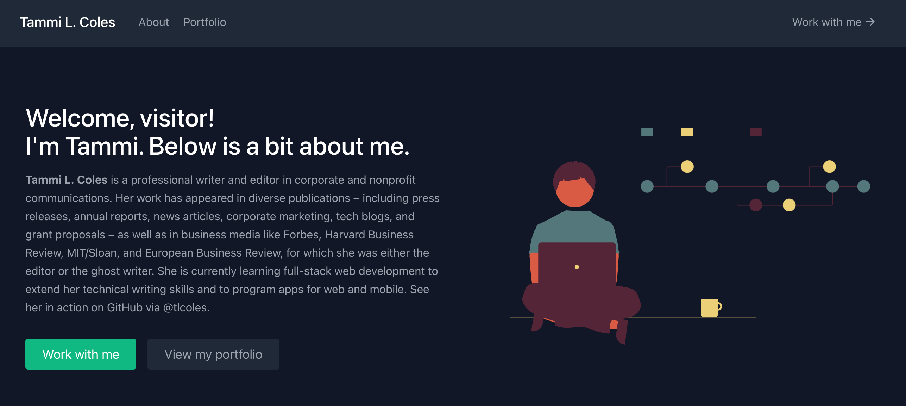

# Challenge 20: React Portfolio
An assignment of the ESMT Coding Boot Camp. The challenge is to build a portfolio website using React. Thus, this project was bootstrapped with [Create React App](https://github.com/facebook/create-react-app). I also relied on the free tutorial ["How to Build a Portfolio Website with React"](https://www.freecodecamp.org/news/build-portfolio-website-react/) provided by FreeCodeCamp.

## Screenshot

## Dependencies
* React v17  
* TailwindCSS  
* Craco  
* Netlify  
* GitHub pages

## Challenges
* Understanding package.json requirements
* Downgrading React
* Using Netlify for form handling  
* Deploying to GitHub Pages
## Gratitude
* FreeCodeCamp tutorial [How to Build a Portfolio Website with React](https://www.freecodecamp.org/news/build-portfolio-website-react/)
* Devwares tutorial [How to create React Forms using Tailwind CSS](https://www.devwares.com/blog/how-to-create-react-forms-using-tailwind-css/)  
* LogRocket [Deploying React apps to GitHub Pages](https://blog.logrocket.com/deploying-react-apps-github-pages/)  
* Deeditor for how to [edit color of SVG online](https://deeditor.com/)

## Contact
Tammi L. Coles  
GitHub: [@tlcoles](https://github.com/tlcoles)  
Netlify deployment: https://wonderful-salmiakki-3c4689.netlify.app/ 
